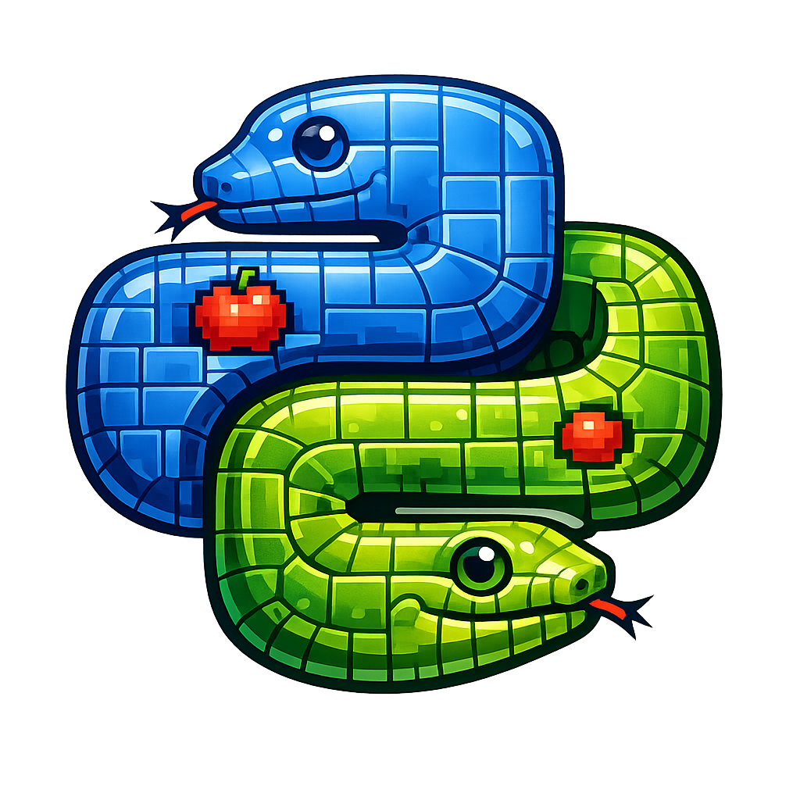

🐍 Snake PY 

Um clássico Snake desenvolvido em Python utilizando Pygame, com visual moderno, velocidade dinâmica e estrutura simples para estudo de lógica, colisão e desenvolvimento de jogos 2D.

🎮 Features
Movimento suave
Sistema de colisão
Crescimento da cobra
Comida aleatória
Game Over
Reinício da partida
Velocidade progressiva
Grid visual
Score em tempo real
Exibição da velocidade atual
📸 Preview
🐍 Snake moderno em Python
⚡ A velocidade aumenta conforme o score
🎯 Objetivo: sobreviver o máximo possível
🚀 Tecnologias
Python 3
Pygame
📦 Instalação

Clone o projeto:

git clone https://github.com/fabyo/snakepy.git

Entre na pasta:

cd snake-py

Instale as dependências:

- pip install pygame
- ▶️ Executando
- python snake.py

```python
🎮 Controles
Tecla	Ação
W / ↑	Mover para cima
S / ↓	Mover para baixo
A / ←	Mover para esquerda
D / →	Mover para direita
R	Reiniciar jogo
```

🧠 Conceitos Aprendidos

Este projeto ajuda a estudar:
```python
Game Loop
Renderização 2D
Sistema de colisão
Coordenadas X/Y
Eventos de teclado
Estruturas de dados
Atualização em tempo real
FPS dinâmico
Manipulação de listas
Estados da aplicação
Lógica de jogos
💥 Sistema de Colisão
```

O jogo possui:
```python
✅ Colisão com parede
✅ Colisão com o próprio corpo
✅ Detecção de comida
✅ Controle espacial baseado em grid
```

⚡ Velocidade Dinâmica

A velocidade aumenta automaticamente conforme o jogador evolui:
```python
current_fps = min(
    INITIAL_FPS + (score * 0.5),
    MAX_FPS
)
```
Isso cria uma progressão mais desafiadora e divertida.
```python
📂 Estrutura
snake-py/
│
├── snake.py
├── README.md
└── assets/
```

Instale:

pip install pyinstaller

Gerar .exe:

pyinstaller --onefile --windowed snake.py

Executável final:

dist/snake.exe
📚 Objetivo Educacional

Este projeto foi criado para estudo e prática de:

- Programação em Python
- Desenvolvimento de jogos
- Lógica de programação
- Sistemas realtime
- Estruturas de dados
- Matemática espacial

